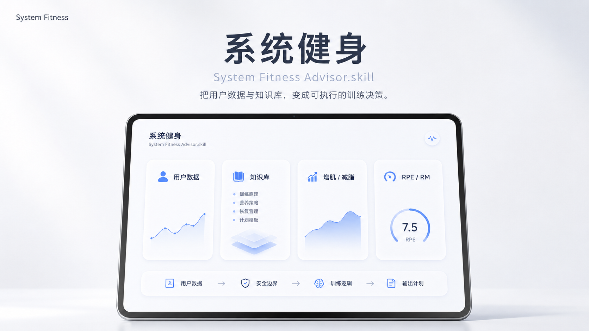

<h1 align="center">系统化健身顾问.skill</h1>
<p align="center">
  
</p>

<p align="center">
  
  
  
  
   
</p>

<p align="center">
  <strong>无论你有任何健身需求 ，都一次性全部满足 <br>
  你的下一个教练何必是教练</strong>
</p>

<p align="center">
  <sub>
    基于开放的 <a href="https://agentskills.io/home">Agent Skills 协议</a>，可在
    Claude Code、Codex、Cursor、OpenClaw、Hermes Agent、CodeBuddy、
    Workbuddy、Gemini CLI、OpenCode 等 50+ 兼容 runtime 中运行。
  </sub>
</p>

<p align="center">
  <strong>
    大多数人不是不努力，而是不知道自己该怎么练。<br>
    系统化健身顾问.skill 会根据用户的目标、经验、器械、时间和身体反馈，<br>
    判断训练结构、动作选择、强度安排和进阶方式，让训练从“瞎练”变成“有系统地练”。
  </strong>
</p>

<p align="center">
  <a href="#效果示例">看效果</a> ·
  <a href="#安装">安装</a> ·
  <a href="#解决了什么痛点">解决什么痛点</a> ·
  <a href="#算法执行流程">算法原理</a>

**其他语言 / Other Languages:**
<p align="center">
  
[English](README_EN.md)

</p>


## 解决了什么痛点？

市面上不缺健身 App，也不缺 AI 健身计划。

但真正困扰训练者的，不是“有没有计划”，而是：

> 我已经练了一段时间了，下一次到底该怎么改？

很多工具能记录训练，很多 AI 能生成模板，但它们常常处理不好这些真实问题：

- 用户历史训练记录没有被持续保存和复用，每次都像第一次咨询
- 杠铃、哑铃、固定器械、肩部孤立动作，全都被同一种加重逻辑硬套
- 动作库没有某个动作时，要么瞎编，要么直接让计划断掉
- 增肌、减脂塑形、部位专攻、力量举，被当成同一种训练逻辑处理
- 用户上传一堆训练截图，却不知道下一次该加重量、加次数、减量还是 deload

**System Fitness Advisor 解决的是这个断层：**

> 从“记录了什么”到“下一次具体怎么练”。

---

## 效果示例

 <strong> 它不会只告诉你“应该优化训练”，它会告诉你下一次训练具体做什么。 </strong>
 
```
用户      ❯ 我卧推最近是 60kg，3 组，每组 8 次。 下次我该怎么练？

fitness    ❯ 杠铃卧推：60kg × 3 组 × 9 次

  目标：先把 3 组都做到 9 次，不急着加重量

  如果下次完成 60kg × 3×9，且 RPE 不超过 8.5：

  再下一次做 60kg × 3×10

  当你能稳定完成 60kg × 3×10：

  再加到 65kg，因为卧推这类杠铃主项按总重 +5kg 递进

```
```
用户      ❯ 站姿器械侧平举 35kg 做满了。下次能不能直接上 40kg？

fitness     ❯ 不建议从 35kg 直接跳到 40kg 以上。

 站姿器械侧平举属于长力臂肩部孤立动作，不应该像卧推一样线性加重。
 
 下一阶段先把 35kg 做到更稳定的 12-15 次，控制离心和顶峰停顿，或加入递减组。

```
再来一个减脂塑形的。
```
用户      ❯ 我减脂两周体重没动，训练还掉力量了。我是该继续少吃，还是加有氧？

fitness    ❯ 先不要立刻大幅降低热量。
  
  你现在同时出现体重停滞和训练表现下降，更像是恢复压力偏高。
 
  先确认 7 日平均体重和腰围趋势。

  如果执行度稳定，优先小幅提高步数，而不是继续砍训练量或猛加有氧。
```


---
## 安装

系统健身顾问基于开放的 [Agent Skills](https://agentskills.io) 协议，可在任何 skills-compatible 的 AI agent runtime 中运行。

### 方式：一行命令（推荐，跨 runtime）

打开你在用的 agent（Claude Code、Codex、Cursor、OpenClaw、Hermes、CodeBuddy、Gemini CLI、OpenCode 等），告诉它：

```
帮我安装这个 skill：https://github.com/Reluctant2828/System-Fitness-Advisor-skill/tree/main/system-fitness-advisor
```
---
## 使用
装好后，告诉 agent：

```
/fitness 
```

按提示输入健身信息（如身高体重、锻炼年限），以及健身需求(增肌还可以细分为三分化，五分化等），然后选择数据来源。不清楚内容均可跳过，会自动冷启动。


### 1. 健身目标

选择或直接描述：

- 增肌
- 减脂塑形
- 部位专攻
- 力量举 / 力量提升
- 不确定，希望系统判断

### 2. 训练条件

- 每周能练几天
- 每次训练多长时间
- 健身房器械情况
- 是否只能居家训练
- 当前是否已经有训练计划

### 3. 数据来源

用户可以选择一种或多种：

- 直接文字输入
- 训练截图
- CSV / 表格
- 健身 App 导出记录
- 历史训练日志
- 饮食记录
- 身体数据，如体重、腰围、照片、体脂估计

如果没有任何历史数据，也可以跳过。

### 4. 训练分化

用户可以选择：

- 二分化
- 三分化 / PPL
- 四分化
- 五分化
- 不知道，让系统推荐

如果用户不懂几分化，System Fitness Advisor 会根据训练目标、每周训练天数、恢复能力和训练经验自动选择。

---

## 支持的数据来源

| 来源 | 支持 | 备注 |
|---|---|---|
| 用户手动输入 | ✅ | 身高、体重、目标、训练经验、器械条件 |
| 训练记录 | ✅ | 支持 Excel、CSV、JSON、Markdown 导入 |
| 健身 App 数据 | ✅ | 例如训记API key 接入 （最推荐）|
| 体测数据 | ✅ | 体重、围度、体脂、力量表现 |
| 饮食记录 | ✅ | 热量、蛋白质、饮水、饮食习惯 |
| 睡眠与恢复 | ✅ | 睡眠时长、疲劳感、酸痛反馈 |
| 图片 / PDF | ✅ | 手动上传训练表、体测报告或截图 |
| 直接粘贴文字 | ✅ | 手动输入当前训练计划或问题 |

---

## 背后算法逻辑

System Fitness Advisor 不是简单生成一份训练计划。

它的核心逻辑是：

> 先理解用户是谁，再判断训练目标，然后读取可用数据，最后输出下一次具体该怎么练。

它不是从模板开始，而是从“决策”开始。


### 决策流程

System Fitness Advisor 会按照下面的顺序工作：

```text
用户输入
  ↓
识别用户目标
  ↓
判断数据来源
  ↓
建立用户训练画像
  ↓
选择训练模块
  ↓
选择训练分化
  ↓
匹配动作库
  ↓
应用现实重量规则
  ↓
输出下一次训练安排
  ↓
根据后续记录继续调整
```
---

## 内置算法知识库

System Fitness Advisor 内置了一套健身决策知识库，用来把用户数据转化为下一次训练安排。

### 已包含

- **用户画像知识库**  
  记录身高体重、训练年限、目标、器械、伤病限制等基础信息。

- **训练记录分析库**  
  分析训练截图、CSV、App 导出和文字记录，判断该加重量、加次数、减量还是 deload。

- **身体数据分析库**  
  分析体重、腰围、照片、体脂趋势，判断减脂、增肌或恢复状态。

- **饮食记录分析库**  
  结合热量、蛋白质、碳水、脂肪和训练表现，判断饮食是否支持当前目标。

- **增肌知识库**  
  支持二分化、三分化/PPL、四分化、五分化，判断训练量、动作安排和进阶方式。

- **减脂塑形知识库**  
  判断热量缺口、有氧、步数、训练量和力量保持策略。

- **部位专攻知识库**  
  支持胸、背、肩、手臂、臀腿、小腿等弱项专项。

- **力量举知识库**  
  支持深蹲、卧推、硬拉、e1RM、top single、back-off 和周期安排。

- **动作库**  
  内置 147 个动作，覆盖胸、背、肩、腿、手臂、臀部、腹部等部位。

- **现实重量规则库**  
  避免生成不现实重量，如机器小数重量、杠铃低于 20kg、肩部孤立动作盲目跳重。

### 核心目标

不是简单生成训练模板，而是回答：

> 用户下一次到底该练什么、用多重、做几组、做几次、怎么进阶。

---

## 算法执行流程

System Fitness Advisor 按固定顺序做训练决策：

1. **读取输入**  
   接收用户资料、训练记录、身体数据、饮食记录或截图。

2. **判断目标**  
   识别用户当前目标：增肌、减脂塑形、部位专攻或力量举。

3. **建立画像**  
   根据训练年限、每周训练天数、器械条件、恢复状态和限制条件建立用户画像。

4. **选择模块**  
   调用对应知识库：增肌、减脂、专项或力量举。

5. **选择分化**  
   根据用户条件选择二分化、三分化/PPL、四分化或五分化。  
   如果用户不懂，系统自动推荐。

6. **匹配动作**  
   从动作库选择动作；如果动作缺失，寻找同槽位替代。

7. **应用重量规则**  
   检查杠铃、哑铃、固定器械和孤立动作的真实重量限制。

8. **生成下一次训练**  
   输出动作、重量、组数、次数、RPE/RIR、休息和进阶规则。

9. **持续更新**  
   根据后续训练记录继续调整计划。

核心逻辑：

> 先分析数据，再判断瓶颈，最后给出下一次具体怎么练。

---

## 仓库结构

```text
system-fitness-advisor/
├── SKILL.md
├── agents/
│   └── openai.yaml
├── data/
│   └── exercise-library.json
├── references/
│   ├── user-profile-intake.md
│   ├── user-data-management.md
│   ├── training-log-analysis.md
│   ├── body-metrics-analysis.md
│   ├── nutrition-log-analysis.md
│   ├── training-algorithm-library.md
│   ├── recommendation-decision-tree.md
│   ├── goal-hypertrophy.md
│   ├── goal-fat-loss-recomposition.md
│   ├── goal-specialization.md
│   ├── goal-powerlifting.md
│   ├── hypertrophy-splits.md
│   ├── ppl-practical.md
│   ├── split-two-division.md
│   ├── split-four-division.md
│   ├── split-five-division.md
│   ├── fat-loss-recomposition-advanced.md
│   ├── specialization-advanced.md
│   ├── powerlifting-advanced.md
│   └── exercise-library-schema.md
├── scripts/
│   ├── summarize_training_logs.py
│   └── manage_user_data.py
├── templates/
│   ├── user-intake.md
│   └── user-data/
│       ├── profile.json
│       ├── training-history.json
│       ├── body-metrics-history.json
│       └── nutrition-history.json
└── examples/
    ├── sample-training-log.csv
    ├── sample-nutrition-log.csv
  └── trigger-tests.md
```
---

## 注意事项

- 本 Skill 用于健身计划分析和训练建议，不用于医疗诊断。
- 如果出现胸痛、眩晕、麻木、剧烈疼痛等异常情况，应停止训练并寻求专业帮助。
- `/fitness` 可能与其他已安装的 fitness skill 冲突，必要时只保留一个。
- 用户不清楚的信息可以跳过，系统会自动冷启动。
- 动作库没有的动作不会被假装存在，会标记为库外动作或提供同槽位替代。
- 固定器械默认按 5kg 一档处理，不生成小数机器重量。
- 杠铃最低为空杆 20kg。
- 杠铃主项默认按总重 +5kg 递进。
- 哑铃按常见哑铃架刻度递进，通常每只 +2.5kg。
- 肩部孤立动作不建议盲目跳重，优先递进次数、控制、密度或递减组。
- 饮食建议只用于支持训练目标，不替代营养师或医生建议。
- 历史数据需要用户授权保存，建议存放在 Skill 文件夹外部。

---

## 关于作者

- **小红书**：[@晓峰Leo](https://xhslink.com/m/7RAAhDPf9Ag)


